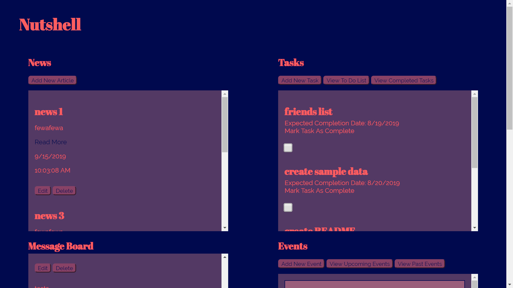

# Nutshell: The Information Dashboard

## Creators (aka Energetic Beefcake)
1. Jacquelyn McCray
1. Michael Stiles
1. Matthew Ross
1. Ellie Ash

Nutshell is a dashboard for people to organize their daily tasks, events, news articles, friends, and chat messages.

These are all of the skills and concepts that Energetic Beefcake used to create Nutshell.

1. Functions
1. Databases/API
1. Github
1. Objects
1. CSS
1. Handling user events
1. Factory functions
1. Data entry/editing
1. Modular code
1. Relational data
1. Session Storage



## How to Launch Nutshell

1. Clone the repository from Github
1. Open your terminal and type the command "npm install" to install Webpack
1. In the main project directory, create a new directory called "API"
1. In the API directory, create a file called "database.json"
1. Copy the sample data below into database.json
1. In the terminal, type the command "npm start". You are now ready to use Nutshell!


## Sample Data
```json
{
  "users": [
    {
      "username": "jimjamb",
      "full_name": "jim jamb",
      "email": "jim@jamb.org",
      "password": "1",
      "id": 1
    },
    {
      "username": "pac-man-iac",
      "full_name": "Billy Mitchell",
      "email": "billy@twingalaxies.com",
      "password": "123",
      "id": 2
    },
    {
      "username": "real_gamer_gurl",
      "full_name": "Ellie Ash",
      "email": "ellie@ellie.org",
      "password": "123",
      "id": 3
    },
    {
      "username": "baby_boi39",
      "full_name": "Michael Stiles",
      "email": "michael@michael.com",
      "password": "123",
      "id": 4
    },
    {
      "username": "jk_mccray",
      "full_name": "Jacquelyn McCray",
      "email": "jacquelyn@jacquelyn.com",
      "password": "123",
      "id": 5
    },
    {
      "username": "mr_database",
      "full_name": "Matt Ross",
      "email": "matt@matt.matt",
      "password": "123",
      "id": 6
    }
  ],
  "news": [
    {
      "news_title": "NEWS DAY",
      "news_synopsis": "this is a day of news",
      "news_url": "http://www.cnn.com/services/rss/",
      "news_date": "2019-08-15",
      "news_time": "11:27:26 AM",
      "userId": 6,
      "id": 1
    },
    {
      "news_title": "The Keanussance",
      "news_synopsis": "Fans are pumped to see Keanu Reeves in 'Matrix 4': 'We are living in the Keanussance'",
      "news_url": "https://www.yahoo.com/entertainment/fans-are-pumped-to-see-keanu-reeves-in-matrix-4-we-are-living-in-the-keanussance-234851660.html",
      "news_date": "2019-08-20",
      "news_time": "11:48:33 AM",
      "userId": 6,
      "id": 2
    },
    {
      "news_title": "Banjo-Kazooie ratings dive",
      "news_synopsis": "After Much Thought, OGN Has Decided To Update Our Review Of 'Banjo-Kazooie' From A 9.7 To A 9.6",
      "news_url": "https://ogn.theonion.com/after-much-thought-ogn-has-decided-to-update-our-revie-1837369382",
      "news_date": "2019-08-19",
      "news_time": "11:50:38 AM",
      "userId": 6,
      "id": 3
    },
    {
      "news_title": "Yeesh",
      "news_synopsis": "Damning Investigation Finds Jeffrey Epstein Left Unsupervised For Decades Prior To Suicide",
      "news_url": "https://www.theonion.com/damning-investigation-finds-jeffrey-epstein-left-unsupe-1837208732",
      "news_date": "2019-08-13",
      "news_time": "11:51:48 AM",
      "userId": 6,
      "id": 4
    }
  ],
  "events": [
    {
      "event_name": "It's the End of the World as far as you know it",
      "event_date": "2012-12-21",
      "event_location": "All over the world",
      "userId": 6,
      "id": 1
    },
    {
      "event_name": "Storm Area 51",
      "event_date": "2019-08-22",
      "event_location": "Roswell, NM",
      "userId": 6,
      "id": 2
    },
    {
      "event_name": "HVAC Sabotaging Party",
      "event_date": "2019-08-28",
      "event_location": "301 Plus Park Blvd",
      "userId": 6,
      "id": 3
    }
  ],
  "tasks": [
    {
      "task_name": "Present Nutshell!",
      "task_date": "2019-08-21",
      "task_completed": false,
      "userId": 6,
      "id": 1
    },
    {
      "task_name": "Hydrate and do my stretches",
      "task_date": "2019-08-31",
      "task_completed": true,
      "userId": 6,
      "id": 2
    },
    {
      "task_name": "eat lunch... if i earned it",
      "task_date": "2019-08-22",
      "task_completed": false,
      "userId": 6,
      "id": 3
    },
    {
      "task_name": "sweep up lunch crumbs",
      "task_date": "2019-08-22",
      "task_completed": false,
      "userId": 6,
      "id": 4
    }
  ],
  "messages": [
    {
      "message": "o... I WISH I WERE AN OSCAR MEYER WIENER",
      "date": "2019-08-21T16:46:03.265Z",
      "userId": 6,
      "id": 1
    },
    {
      "message": "it's *mayer, actually",
      "date": "2019-08-21T16:35:46.508Z",
      "userId": 3,
      "id": 2
    },
    {
      "message": "oh great!!!! SOOOOO glad someone's looking out for the spelling interests of 'big hotdog'. @real_gamer_gurl is a real american hero.",
      "date": "2019-08-21T16:46:20.710Z",
      "userId": 6,
      "id": 3
    },
    {
      "message": "@mr_database --- hey man, you brought it up in the first place",
      "date": "2019-08-21T16:38:13.711Z",
      "userId": 4,
      "id": 4
    },
    {
      "message": "y'all. there are unswept lunch-dog crumbs EVERYWHERE. ",
      "date": "2019-08-21T16:40:31.827Z",
      "userId": 5,
      "id": 5
    },
    {
      "message": "wake up sheeple - we have always been, and currently are AT TREVECCA. if you think we're NOT living in a simulation, you really are drunk on the kool-aid of the masses",
      "date": "2019-08-21T16:41:58.624Z",
      "userId": 4,
      "id": 6
    }
  ],
  "friends": []
}
```

## Acknowledgments
Energetic Beefcake would like to thank Jenna Solis, Bryan Nilsen, and Steve Brownlee for their help throughout this project.